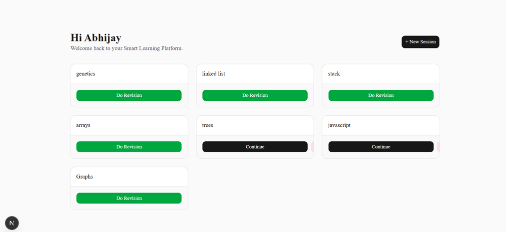
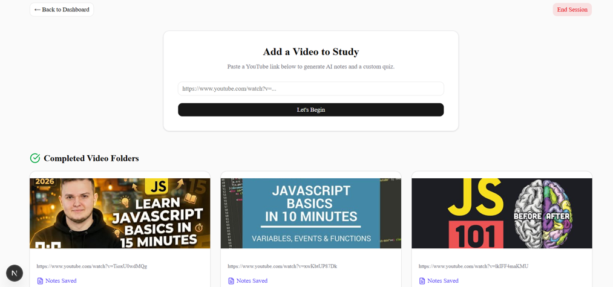
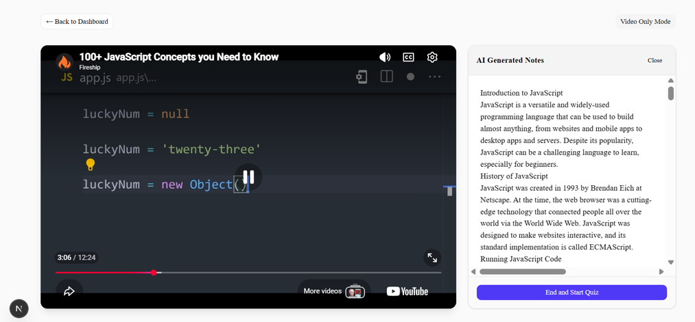
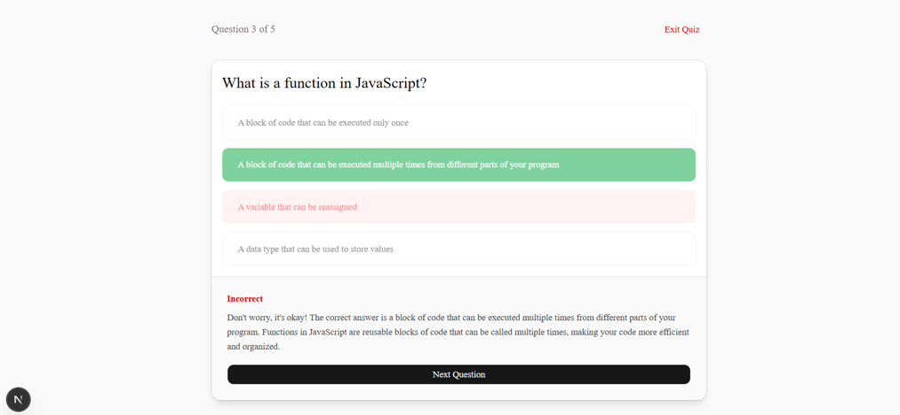
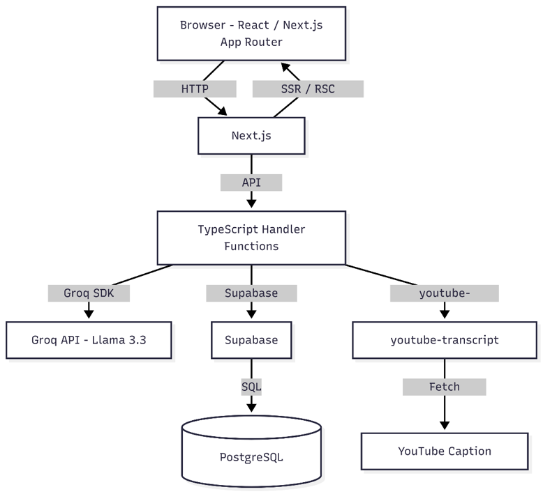
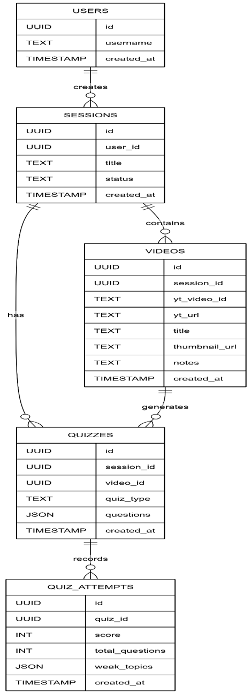

# VibeLearn - AI-Powered Learning Workspace

**🚀 [NEW] Version 2.0 is Live!**
VibeLearn has officially transitioned from a student MVP to a production-grade SaaS workspace. 
* **Legacy MVP Branch:** Want to see where this started? [Click here to view the v1.0 MVP code](#).
* **V2 Demo Video:** [Link to your NEW YouTube video]
* **V1 Legacy Demo:** [Link to your old YouTube video]

### What's new in V2.0?
* **PostgreSQL RPC Analytics:** Bypassed Vercel serverless timeouts by writing custom database functions to aggregate user study streaks and mastery metrics in milliseconds.
* **Premium Workspace UI:** Redesigned the study session into a mutually exclusive, distraction-free environment using Tailwind CSS and Radix UI primitives.
* **Semantic Dark Mode:** Engineered a high-contrast Slate theme to reduce eye strain during late-night study sessions.
* **Adaptive Revision Loop:** Visualized user knowledge gaps with dynamic tagging and seamless LLM-generated targeted quizzes.

AI-Powered Personalized Learning and Adaptive Revision Platform

## Demo Video

🎥 YouTube Demo: https://youtu.be/cPQ1sjfz0nI

---

## Project Overview

VibeLearn is an AI-powered learning platform that transforms educational YouTube videos into structured study material.

Instead of passively watching lectures, learners can generate AI-created notes, attempt quizzes, identify weak topics, and continuously revise concepts through adaptive revision quizzes.

The platform converts educational video content into an active learning workflow using transcript extraction, Large Language Models (LLMs), and performance-driven revision.

---

## Key Features

### Learning Phase

* Extract transcripts from YouTube videos
* Generate structured Markdown study notes
* Store processed learning material
* Organize content into study sessions
* Revisit previously studied videos

### Assessment Phase

* Generate AI-created MCQ quizzes
* Evaluate answers instantly
* Display explanations
* Track quiz performance

### Adaptive Revision

* Identify weak topics from quiz attempts
* Aggregate and deduplicate weak topics
* Generate revision quizzes focused on previously weak areas
* Support continuous performance-driven revision

### Historical Learning Repository

* Access previously processed videos
* View generated notes
* Browse stored YouTube thumbnails
* Continue learning from past sessions

---

## System Workflow

```text
User
↓
Create Study Session
↓
Paste YouTube URL
↓
Transcript Extraction
↓
AI Note Generation
↓
Store Notes
↓
Generate Quiz
↓
Attempt Quiz
↓
Track Weak Topics
↓
Generate Adaptive Revision Quiz
```

---

## Screenshots

### Dashboard



### Session Workspace



### AI-Generated Notes



### Quiz Interface



---

## System Architecture



The application follows a monolithic full-stack architecture using Next.js as both frontend and backend runtime.

Components:

* Next.js App Router
* API Routes
* Groq API (Llama 3.3 70B)
* Supabase
* PostgreSQL
* youtube-transcript

---

## Database Design



Database Tables:

* users
* sessions
* videos
* quizzes
* quiz_attempts

---

## Tech Stack

### Frontend

* Next.js (App Router)
* React
* TypeScript
* Tailwind CSS
* Shadcn/UI
* React Markdown

### Backend

* Next.js API Routes
* TypeScript

### Database

* Supabase
* PostgreSQL

### AI

* Groq API
* Llama 3.3 70B Versatile

### Additional Libraries

* youtube-transcript
* Lucide React

---

## Project Structure

```text
src/
├── app/
├── components/
├── context/
├── lib/
└── types/

public/

docs/
├── VibeLearn_Project_Report.pdf

README-assets/
├── dashboard.png
├── session-workspace.png
├── notes-view.png
├── quiz-interface.png
├── architecture-diagram.png
└── erd-diagram.png
```

---

## Installation

### Clone Repository

```bash
git clone https://github.com/Abhijay-Nagal/vibe-learn.git
cd vibe-learn
```

### Install Dependencies

```bash
npm install
```

### Configure Environment Variables

Create:

```env
.env.local
```

using:

```env
NEXT_PUBLIC_SUPABASE_URL=your_supabase_url
NEXT_PUBLIC_SUPABASE_ANON_KEY=your_supabase_anon_key
GROQ_API_KEY=your_groq_api_key
```

### Run Development Server

```bash
npm run dev
```

Open:

```text
http://localhost:3000
```

---

## Current Status

### Phase-I MVP

Implemented:

* User onboarding
* Session management
* AI note generation
* Quiz generation
* Quiz evaluation
* Weak topic tracking
* Adaptive revision quizzes
* Historical learning repository
* Groq integration
* Supabase integration

---

## Future Scope

* Flashcard generation
* Progress analytics dashboard
* RAG-based retrieval
* Vector search
* Recommendation engine
* Enhanced authentication
* Mobile application

---

## Documentation

📄 Project Report:

`docs/VibeLearn_Project_Report.pdf`

---

## Author

**Abhijay Nagal**

Computer Science Engineering Student

Thapar Institute of Engineering and Technology

---

## License

This project is intended for academic and educational purposes.
